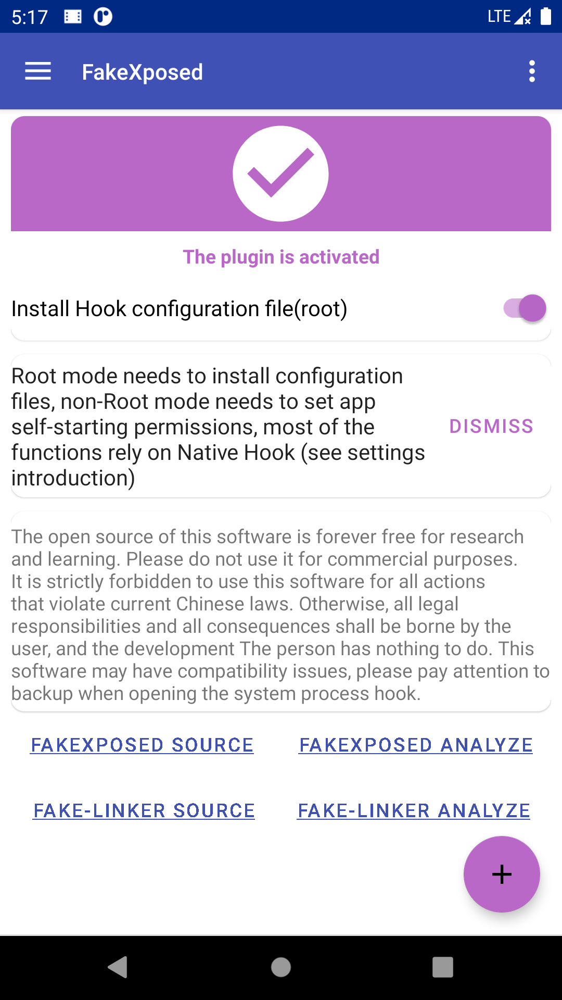
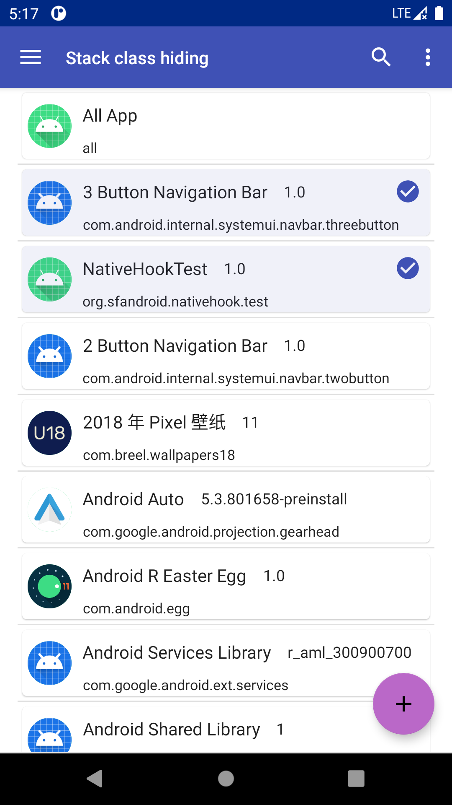
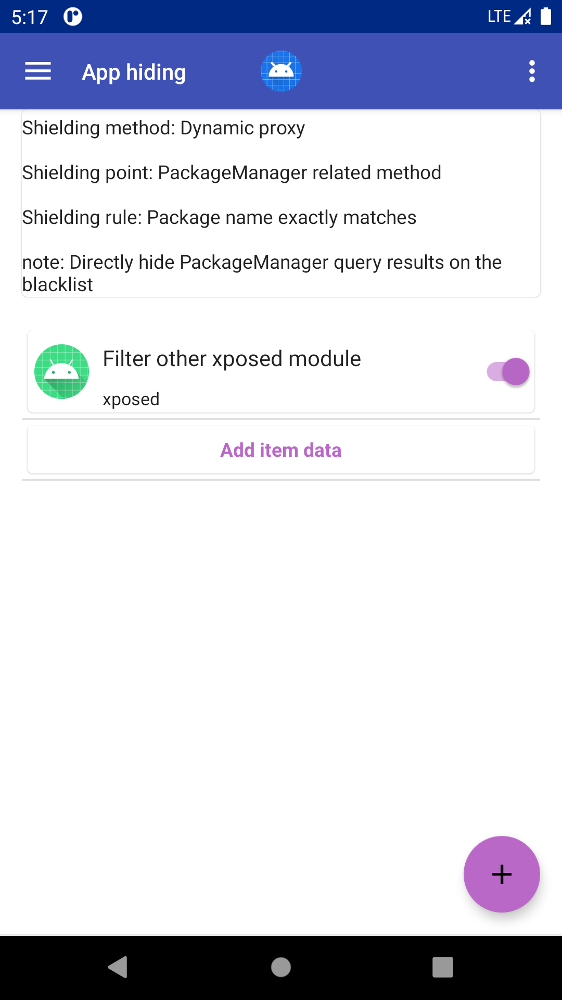
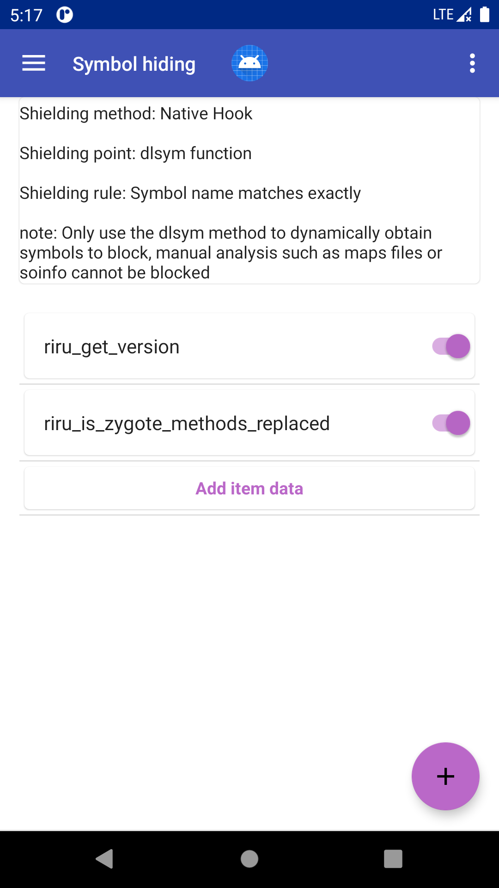

# FakeXposed


Chinese document click [here](README_CN.md)

## QQ Group [1042999608](https://jq.qq.com/?_wv=1027&k=T2uqtjjE)
- Since there may be many problems at present, Q group can be added to facilitate communication

    

## Changlog
[Changelog](docs/en/app_changes.md)

## Project description
Use [fake-linker](https://github.com/sanfengAndroid/fake-linker) in combination with `Xposed` to provide `Java` and `Native` bidirectional shielding of `Xposed` detection, and also provide additional file redirection, `JNI` monitor, file access control, provide to other modules to dynamically add or modify the configuration in the process. 

## Principle analysis introduction
View [FakeXposed principle analysis](https://sanfengandroid.github.io/2021/02/20/fakexposed-principle-analyze/) 

## Supported Android
Android version: `Android 5.0` ~ `Android 11`+. Support instructions: `x86`, `x86_64`, `arm`, `arm64`.`Api 25` Because the new version of `NDK` is removed, you need to change the `NDK` version to adapt and compile 

## Build
- Required build environment: Any platform that supports `Android Studio`, `Python 3.6+` (for script build) 
- Build configuration: Edit [local.properties.sample](local.properties.sample) sample configuration and rename it to `local.properties` or pass the configuration path `-PconfigPath` to `gradle` 
- Clone sources: `git clone --recurse-submodules https://github.com/sanfengAndroid/FakeXposed.git`
- Android Studio build: Import the source code into `Android Studio`, modify the configuration and compile
- Command line build
  - Install Python 3.6+ (Windows platform only: add `Python` to the environment variable `PATH`, and run `pip install colorama`) 
  - Set `ANDROID_SDK_ROOT` to the system environment variable, and install `Android NDK 22.0.7026061`, which can be done in `Android Studio SDK Manager`
  - Run `python build.py -vrm all` to execute a complete `Release` build 
  - Run `python build.py -vrm api 30` to compile only `Android Api level 30`
  - For more options, please see the [build.py](build.py) script
  - Note that `Android Api 25` uses the native module of `Android Api 24`. The `Api 24` used during compilation will not correspond to libxxx25.so

## Download
[Download the latest Release version](https://github.com/sanfengAndroid/FakeXposed/releases/latest)

## Usage
1. This application is the `Xposed` module, not limited to the original `Xposed`, `Taichi`, `EdXposed`, `VirtualXposed`, you need to enable the module in the specified `Xposed manager` .Normal status is as follows 
2. Enable `Global Hook` and specify `Application Hook` as needed, and the module will determine whether to enable an application separately. Long press to turn on/off 
3. Configure different hook options for each application or globally, such as file blacklist, hidden `maps` rules, file redirection, access control, package visibility, etc.  
4. `Android 7` The following data sharing uses `XSharedPreferences` without additional permissions. If you have `root` permissions on Android 7 and above, it is recommended to use `root` permissions to install configuration files to another path for other applications to access, otherwise you need to set This software has `self-start` permission, and uses `ContentProvider` to exchange data, which may significantly increase the start-up time 

## Other module calls
- Get the `ClassLoader` of the module

    Hook an unused method in the application `ClassLoader.defineClass`
    ```Java
    XposedHelpers.findAndHookMethod(ClassLoader.class, "defineClass", String.class, byte[].class, int.class, int.class, new XC_MethodHook() {
        @Override
        protected void beforeHookedMethod(MethodHookParam param) throws Throwable {
            String name = (String) param.args[0];
            if (TextUtils.equals(name, BuildConfig.APPLICATION_ID)){
                LogUtil.d(TAG, "define class get self class");
                param.setResult(NativeHook.class);
            }
        }
    });
    ```
    Obtain `NativeHook.class` by calling as follows. Note that `defineClass` has several overloaded methods. Only the ones that match the above signature can be obtained, otherwise you will get an exception
    ```Java
    Method method = ClassLoader.class.getDeclaredMethod("defineClass", String.class, byte[].class, int.class, int.class);
    method.setAccessible(true);
    Class<?> nativeHook = (Class<?>) method.invoke(getClassLoader(), BuildConfig.APPLICATION_ID, null, 0, 0);
    ```
    Get the `NativeHook.class` to get the corresponding `ClassLoader`, and then call various functions through reflection to add or delete configurations

    **Note: The loading order of Xposed modules is not controllable, so it is best to enter the application execution timing (such as the application Application.onCreate method) and then obtain `NativeHook.class`, and then use reflection operation, the source package name is `com.sanfengandroid.fakeinterface The classes under `will not be confused**
- Invoke interface

    The data mainly involves `Java` and `Native` data, all of which contains the complete configuration in `Java` [GlobalConfig](app/src/main/java/com/sanfengandroid/fakeinterface/GlobalConfig.java), the core data is as follows
    ```Java
    public class GlobalConfig {
        private static final String TAG = GlobalConfig.class.getSimpleName();
        private static final Map<String, ?>[] maps;
        private static final Object EXIST = new Object();
        private static final Map<String, String> classBlacklist = new HashMap<>();
        private static final Map<String, String> stackClassBlacklist = new HashMap<>();
        private static final Map<String, String> packageBlacklist = new HashMap<>();
        private static final Map<Integer, Object> hookMethodModifierFilter = new HashMap<>();
        private static final ObservableMap<String, String> propBlacklist = new ObservableMap<>();
        private static final ObservableMap<String, EnvBean> envBlacklist = new ObservableMap<>();
        private static final Map<String, String> globalPropertyBlacklist = new HashMap<>();
        private static final Map<String, String> componentKeyBlacklist = new HashMap<>();
        private static final Map<String, String> globalSettingsBlacklist = new HashMap<>();
        private static final Map<String, ExecBean> runtimeBlackList = new HashMap<>();
        private static final Map<String, String> fileBlacklist = new HashMap<>();
        private static final Map<String, String> symbolBlacklist = new HashMap<>();
        private static final Map<String, String> mapsBlacklist = new HashMap<>();
        private static final Map<String, String> fileRedirectList = new HashMap<>();
        private static final Map<String, String> fileAccessList = new HashMap<>();
    }
    ```
    -`Java Hook` data modification: directly reflect and modify the above `Map` object to take effect
    -`Native Hook` data modification: In addition to modifying the above `Map` object, you need to call [NativeInit.nativeSync](app/src/main/java/com/sanfengandroid/fakeinterface/NativeInit.java#nativeSync), which will clear some `native` data (file blacklist, symbol blacklist, attribute replacement, etc.) and then re-synchronized to `native`, which means that some old data is still in effect (maps rule, file redirection, file access permission configuration), but It can be updated
    ```cpp
    static void NativeHook_ClearAll(JNIEnv *env, jclass clazz) {
        file_blacklist.clear();
        file_path_blacklist.clear();
        symbol_blacklist.clear();
        properties.clear();
    }
    ```
    There are some other `Native` interfaces that can be viewed by themselves. [NativeHook](app/src/main/java/com/sanfengandroid/fakeinterface/NativeHook.java) Just call those public methods by reflection

**Note: This application may have compatibility issues, please make a backup when the Hook system is in progress**

**The application has not undergone a lot of testing. If you have any questions, you can leave a message on github, blog or wechat public**
## Reference
[RootCloak](https://github.com/devadvance/rootcloak)

[XposedChecker](https://github.com/w568w/XposedChecker)