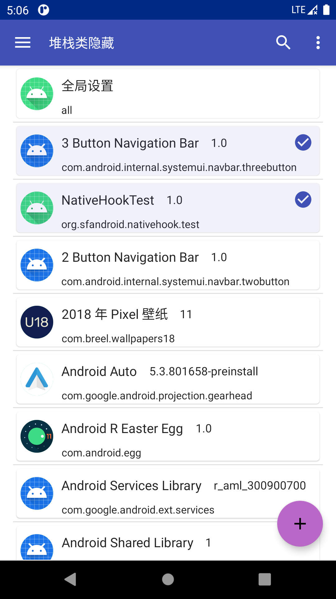
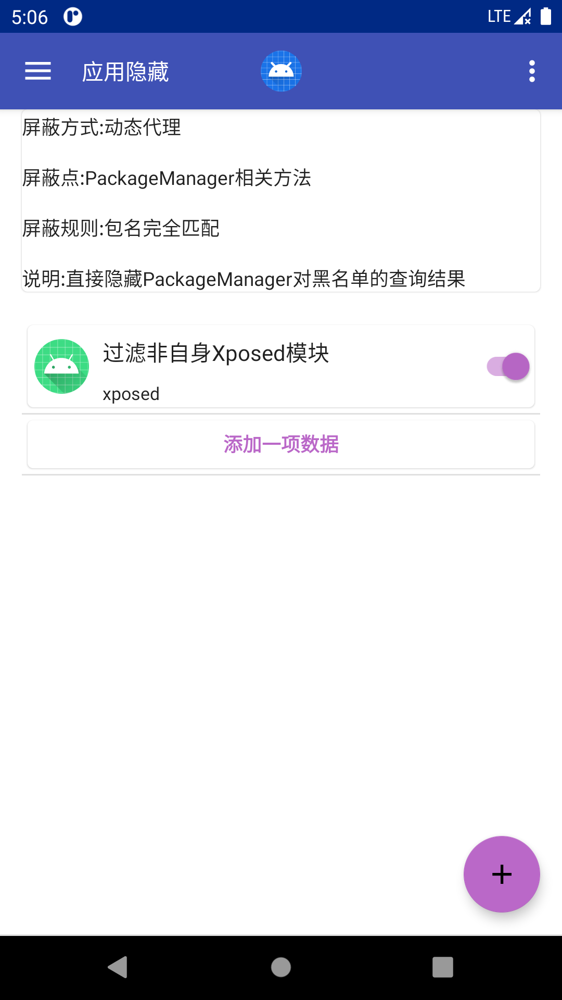
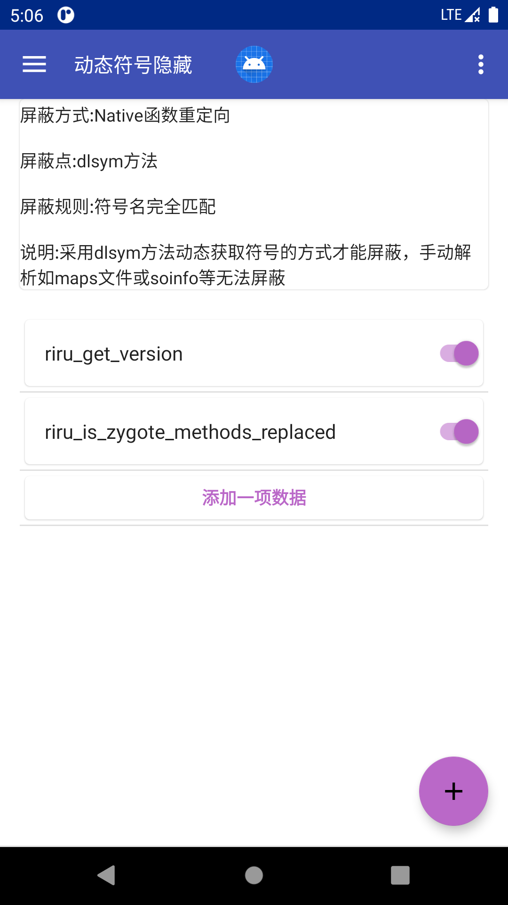

# FakeXposed


## 项目描述
使用 [fake-linker](https://github.com/sanfengAndroid/fake-linker) 与 `Xposed` 结合，提供 `Java` 和 `Native` 双向屏蔽 `Xposed`检测，还提供额外的文件重定向、`JNI`监听、文件访问权限控制、提供给其它模块在进程内动态添加或修改配置。

## 原理分析介绍
查看 [FakeXposed原理分析](https://sanfengandroid.github.io/2021/02/20/fakexposed-principle-analyze/)

## 支持的Android版本
支持版本：`Android 5.0 ~ Android 11+`，支持架构：`x86`，`x86_64`，`arm`，`arm64`，`Api 25`由于新版本 `NDK` 移除需要自行改变 `NDK` 版本适配编译

## 构建
- 需要的编译环境：任何支持`Android Studio`的平台， `Python 3.6+`（脚本编译使用）
- 编译配置：编辑 [local.properties.sample](local.properties.sample) 示例配置，改名为 `local.properties` 或向 `gradle` 传递配置路径 `-PconfigPath`
- 克隆源码: `git clone --recurse-submodules https://github.com/sanfengAndroid/FakeXposed.git`
- Android Studio构建：导入源码到 `Android Studio`中 修改配置编译即可
- 命令行编译
  - 安装Python 3.6+（Windows平台：添加 `Python` 到环境变量`PATH`中，并运行 `pip install colorama`）
  - 设置 `ANDROID_SDK_ROOT` 到系统环境变量，并安装`Android NDK 22.0.7026061`，可在`Android Studio SDK Manager`中完成
  - 运行 `python build.py -vrm all` 执行完整 `Release` 编译
  - 运行 `python build.py -vrm api 30`只编译`Android Api level 30`
  - 更多选项请查看 [build.py](build.py) 脚本

## 下载
[最新Release版本下载](https://github.com/sanfengAndroid/FakeXposed/releases/latest)

## 使用介绍
1. 本软件是`Xposed`模块，不限于原版`Xposed`，`Taichi`，`EdXposed`，`VirtualXposed`，需到指定的 `Xposed管理器` 中启用该模块，状态正常则如下 
2. 根据需要开启`全局Hook` 和指定 `应用Hook`，模块内部会单独判断对某个应用是否启，长按开启/关闭 

3. 为每一个应用或全局配置不同的Hook选项，如文件黑名单、隐藏`maps`规则、文件重定向、访问控制、包可见性等  
4. `Android 7` 以下数据共享使用 `XSharedPreferences` 无需额外权限，`Android 7` 以上如果有 `root` 权限推荐使用 `root` 权限来安装配置文件到另外的路径以供其它应用访问，否者需要设置本软件 `自启动` 权限，使用 `ContentProvider` 交换数据，这可能会显著增加启动时长

## 其它模块调用
- 获取模块的 `ClassLoader`

    应用内部Hook一个不被使用的方法 `ClassLoader.defineClass`
    ```Java
    XposedHelpers.findAndHookMethod(ClassLoader.class, "defineClass", String.class, byte[].class, int.class, int.class, new XC_MethodHook() {
        @Override
        protected void beforeHookedMethod(MethodHookParam param) throws Throwable {
            String name = (String) param.args[0];
            if (TextUtils.equals(name, BuildConfig.APPLICATION_ID)){
                LogUtil.d(TAG, "define class get self class");
                param.setResult(NativeHook.class);
            }
        }
    });
    ```
    通过如下调用获取 `NativeHook.class`，注意 `defineClass` 有几个重载方法，只有匹配上面签名的才可以获取，否者会得到异常
    ```Java
    Method method = ClassLoader.class.getDeclaredMethod("defineClass", String.class, byte[].class, int.class, int.class);
    method.setAccessible(true);
    Class<?> nativeHook = (Class<?>) method.invoke(getClassLoader(), BuildConfig.APPLICATION_ID, null, 0, 0);
    ```
    获取到 `NativeHook.class` 就能够获取到对应的 `ClassLoader`，然后通过反射调用各种函数来添加或删除配置

    **注意：Xposed 模块的加载顺序不可控制，因此最好进入应用执行时机（如应用Application.onCreate方法）后再获取`NativeHook.class`，然后通过反射操作，源码包名 `com.sanfengandroid.fakeinterface` 下的类都不会被混淆**
- 调用接口

    数据主要涉及到 `Java` 和 `Native`数据，其中所有数据在 `Java` [GlobalConfig](app/src/main/java/com/sanfengandroid/fakeinterface/GlobalConfig.java) 中包含完整配置，核心数据如下
    ```Java
    public class GlobalConfig {
        private static final String TAG = GlobalConfig.class.getSimpleName();
        private static final Map<String, ?>[] maps;
        private static final Object EXIST = new Object();
        private static final Map<String, String> classBlacklist = new HashMap<>();
        private static final Map<String, String> stackClassBlacklist = new HashMap<>();
        private static final Map<String, String> packageBlacklist = new HashMap<>();
        private static final Map<Integer, Object> hookMethodModifierFilter = new HashMap<>();
        private static final ObservableMap<String, String> propBlacklist = new ObservableMap<>();
        private static final ObservableMap<String, EnvBean> envBlacklist = new ObservableMap<>();
        private static final Map<String, String> globalPropertyBlacklist = new HashMap<>();
        private static final Map<String, String> componentKeyBlacklist = new HashMap<>();
        private static final Map<String, String> globalSettingsBlacklist = new HashMap<>();
        private static final Map<String, ExecBean> runtimeBlackList = new HashMap<>();
        private static final Map<String, String> fileBlacklist = new HashMap<>();
        private static final Map<String, String> symbolBlacklist = new HashMap<>();
        private static final Map<String, String> mapsBlacklist = new HashMap<>();
        private static final Map<String, String> fileRedirectList = new HashMap<>();
        private static final Map<String, String> fileAccessList = new HashMap<>();
    }
    ```
    - `Java Hook` 数据修改： 直接反射修改上面的 `Map` 对象即可生效
    - `Native Hook` 数据修改：除了修改上面的 `Map` 对象还需要调用 [NativeInit.nativeSync](app/src/main/java/com/sanfengandroid/fakeinterface/NativeInit.java#nativeSync)，这会清除部分 `native` 数据（文件黑名单，符号黑名单，属性替换等）然后重新同步至 `native`，这意味着有些旧数据还是在生效中（maps规则、文件重定向、文件访问权限配置），清除它们可能会引起不必要的问题，但是它可以被更新
        ```cpp
        static void NativeHook_ClearAll(JNIEnv *env, jclass clazz) {
            file_blacklist.clear();
            file_path_blacklist.clear();
            symbol_blacklist.clear();
            properties.clear();
        }
        ```
        还有一些其它的 `Native` 接口可以自行查看 [NativeHook](app/src/main/java/com/sanfengandroid/fakeinterface/NativeHook.java) 反射调用那些公开的方法即可

**注意：本应用可能存在兼容性问题，在Hook系统进程时请做好备份**

**软件没有经过大量测试，有问题可以github、博客留言、公众号留言均可**
## 参考
[RootCloak](https://github.com/devadvance/rootcloak)

[XposedChecker](https://github.com/w568w/XposedChecker)